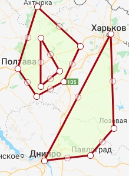

## Geography 
### What we do:
- calculate distances between devices
- is the point inside the polygon?
- polygon coverage
- working with projections and re-projecting data
### WKT 
Well-known text (WKT) is a text markup language for representing vector geometry objects on a map, spatial reference systems of spatial objects and transformations between spatial reference systems. A binary equivalent, known as well-known binary (WKB), is used to transfer and store the same information on databases. [Wiki](https://en.wikipedia.org/wiki/Well-known_text)

Examples:    
- Kharkiv Coordinates    
`POINT (49.9935 36.2304)`    
- Kharkiv - Kiev - Lviv line    
`LINESTRING (49.9935 36.2304, 50.4501 30.5234, 49.8397 24.0297)`    
- Kharkiv - Kiev - Lviv - Odessa quad    
`POLYGON(49.9935 36.2304, 50.4501 30.5234, 49.8397 24.0297, 46.4825, 30.7233, 49.9935 36.2304)`    
etc.    

We had a lot of `Fields` and `Locations` stored in database. They all are represented with `MULTIPOLYGONS`.    
Multipolygon is an aggregate of multiple polygons.    
E.g.
`MULTIPOLYGON (((35.02769194278926 48.466945072396236,36.26914702091426 50.00900677473481,36.32407866153926 48.86601241710432,35.88462553653926 48.53246329349378,35.02769194278926 48.466945072396236)), ((34.53330717716426 49.590627339715994,34.89585600528926 50.3326955326128,35.69785795841426 49.86050639066826,35.39024077091426 49.433695451520556,34.88486967716426 49.25475232008265,34.53330717716426 49.590627339715994), (34.96177397403926 49.95955749204947, 34.96177397403926 49.37650444784831 ,35.31333647403926 49.562131715107796, 34.96177397403926 49.95955749204947)))`    

    
Drawn with [Wicket](https://arthur-e.github.io/Wicket/sandbox-gmaps3.html)    

### Geotools and JTS
- reading wkt
- primitives
- find closest point on polygon
- calculate distances
- are we inside?
- reprojecting
- cutting polygons
### Haversine distance
- distance between points on a globe in KM