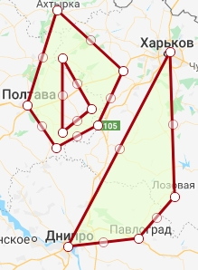

# Table of contents

1. [Fetching data from Postgres tables](#fetching-data-from-postgres-tables)
2. [Geography](#geography)     
    2.1 [WKT](#wkt)    
    2.2 [GeoTools and JTS](#geotools-and-jts)     

# Fetching data from Postgres tables
We've used PostgreSQL database in our project. Here's some handy code we've used.    

- Load postgres driver    
    ```scala
    val driver = "org.postgresql.Driver"
    Class.forName(driver)
    ```

- connection     
    ```scala
    val url = "http://postgres:5432/db"
    val user = "pguser"
    val password = "pgpass"
    val connection = DriverManager.getConnection(url, user, password)
    ```
- statements    

    ```scala
    val query = "select x, y from table"
    val statement = connection.createStatement()
    val result = statement.execute(query)
    ```

- iterators (load table)    
We've used native Java connection, and to simplify data loading we've used Iterators.

    ```scala
    val data = Iterator.continually((result.next(), result))
    .takeWhile(_._1)
    .map(_._2)
    .map(e => (e.getInt("x"), e.getInt("y")))
    .toMap
    ```

---

# Geography
## What we do:
- work with geometry
- calculate distances between devices
- is the point inside the polygon?
- polygon coverage
- working with projections and re-projecting data
## WKT
Well-known text ([WKT]((https://en.wikipedia.org/wiki/Well-known_text))) is a text markup language for representing vector geometry objects on a map, spatial reference systems of spatial objects and transformations between spatial reference systems. A binary equivalent, known as well-known binary (WKB), is used to transfer and store the same information on databases.

Examples:    
- Kharkiv Coordinates    
`POINT (49.9935 36.2304)`    
- Kharkiv - Kiev - Lviv line    
`LINESTRING (49.9935 36.2304, 50.4501 30.5234, 49.8397 24.0297)`    
- Kharkiv - Kiev - Lviv - Odessa quad    
`POLYGON(49.9935 36.2304, 50.4501 30.5234, 49.8397 24.0297, 46.4825, 30.7233, 49.9935 36.2304)`    
etc.    

We had a lot of `Fields` and `Locations` stored in database. They all are represented with `MULTIPOLYGONS`.    
Multipolygon is an aggregate of multiple polygons.    
E.g.    
```scala
MULTIPOLYGON (
    (( // quad
        35.02769194278926 48.466945072396236, 36.26914702091426 50.00900677473481,
        36.32407866153926 48.86601241710432, 35.88462553653926 48.53246329349378,
        35.02769194278926 48.466945072396236
    )),
    (
        ( // 5-angled figure
            34.53330717716426 49.590627339715994, 34.89585600528926 50.3326955326128,
            35.69785795841426 49.86050639066826, 35.39024077091426 49.433695451520556,
            34.88486967716426 49.25475232008265, 34.53330717716426 49.590627339715994
        ),
        ( // triangle cut
            34.96177397403926 49.95955749204947, 34.96177397403926 49.37650444784831,
            35.31333647403926 49.562131715107796, 34.96177397403926 49.95955749204947
        )
    )
)
```

    
Drawn with [Wicket](https://arthur-e.github.io/Wicket/sandbox-gmaps3.html)    

---

## Geotools and JTS
- #### Java Topology Suite    
    The [JTS](https://github.com/locationtech/jts) Topology Suite is a Java library for creating and manipulating vector geometry.    
    We've used it to operate on geometry from database.

- #### GeoTools
    [GeoTools](http://geotools.org/) is an open source Java library that provides tools for geospatial data.


- **Reading WKT**    
All the polygons in the database were saved in WKB (Well Known Binary format), but we've been converting it to WKT prior to reading it in our app.
Then we've read them with `WKTReader`.

    ```scala
    val reader = new WKTReader()
    val line = "LINESTRING (49.9935 36.2304, 50.4501 30.5234, 49.8397 24.0297)"
    val geom: LineString = reader.read(line).asInstanceOf[LineString]
    ```

- **Writing WKT**    
Just for example:    

    ```scala
    val writer = new WKTWriter()
    val wkt = writer.write(geom)
    ```

- **Writing WKB**    
We had to update some of polygons in the database. So we were writing WKB back to database.    

    ```scala
    val writer = new WKBWriter()
    val wkt = writer.write(geom)
    ```

- **Find closest point on polygon**    
We had a task to detect distance of Device to a Location. It is then used to identify if point belongs to the polygon.

    ```scala
    val closestPointOnPolygon = DistanceOp.nearestPoints(polygon, point)(0) // get point on 1st (0th) object
    closestPointOnPolygon
    ```

- **Calculate distances between two points**    
We've used [Orthodromic Distance](https://en.wikipedia.org/wiki/Great-circle_distance) to calculate distances between two points.

    ```scala
    private val crs = CRS.decode("EPSG:4326") //  referencing system
    private val gc = new GeodeticCalculator(crs)

    val pt = closestPoints.closestPoint(square, point)

    gc.setStartingGeographicPoint(pt.getX(), pt.getY())
    gc.setDestinationGeographicPoint(point.getX(), point.getY())
    gc.getOrthodromicDistance
    ```

- **Are we inside?**    
If the distance was zero, we consider that the point is inside the polygon. (that simple, yes)

- **Cutting polygons**    
Equipments that were working on the fields, say, Combines, were "covering" the field. The idea was, that if field is covered up to a certain margin it can be considered complete.
We were drawing a tiny square around equipments' coordinates, and we were "cutting" this square from the fields polygon.

    ```scala
    field.difference(equipmentSquare)
    ```

- **Reprojecting**  
One of the most difficult problems to solve was the accuracy of area calulations.
All polygons' coordinates are stored in Lat-Long format (regular GPS coordinates) which is in EPSG:4326 ([WGS 84](http://spatialreference.org/ref/epsg/wgs-84/)) Coordinate Referencing System. It spreads worldwide but it has no accuracy, no units, nothing. So it is not suitable to use for area calculation.     
We've reprojected from WGS 84 to [UTM](https://en.wikipedia.org/wiki/Universal_Transverse_Mercator_coordinate_system) zones depending on the central coordinates of each field. UTM does not give best accuracy, but it was good enough.
It was implemented on PostGIS side using [this](https://lists.osgeo.org/pipermail/postgis-users/2005-December/010253.html) approach.

    ```scala
    val sourceCRS = CRS.decode("EPSG:4326")
    val targetCRS = CRS.decode("EPSG:32633")
    val transform = CRS.findMathTransform(sourceCRS, targetCRS, true)
    val geog: Geometry = JTS.toGeographic(shape, sourceCRS)
    JTS.transform(geog, transform)
    ```